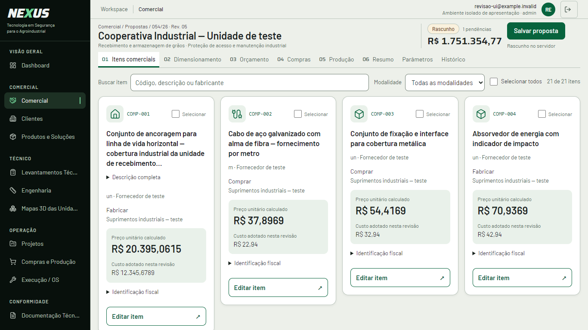
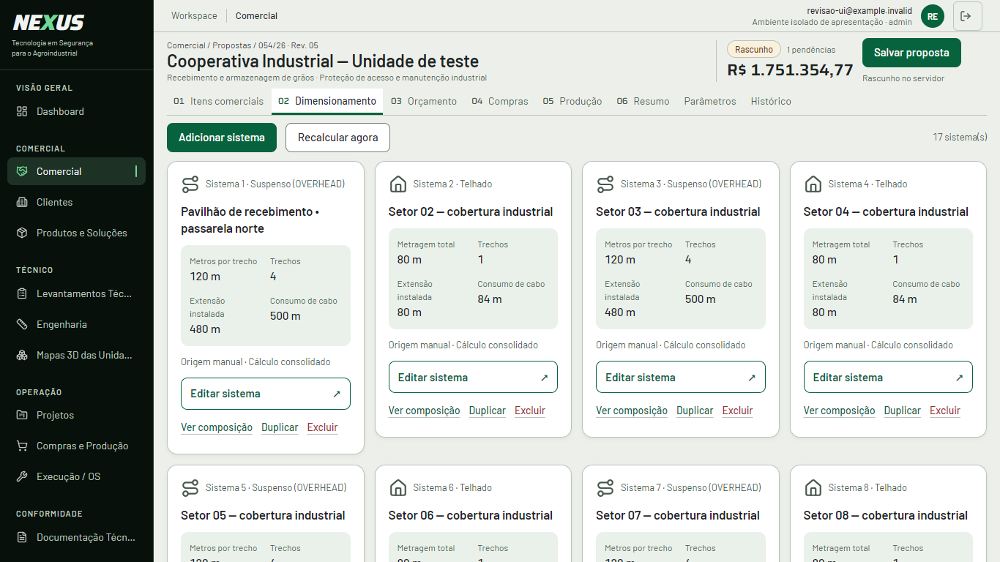
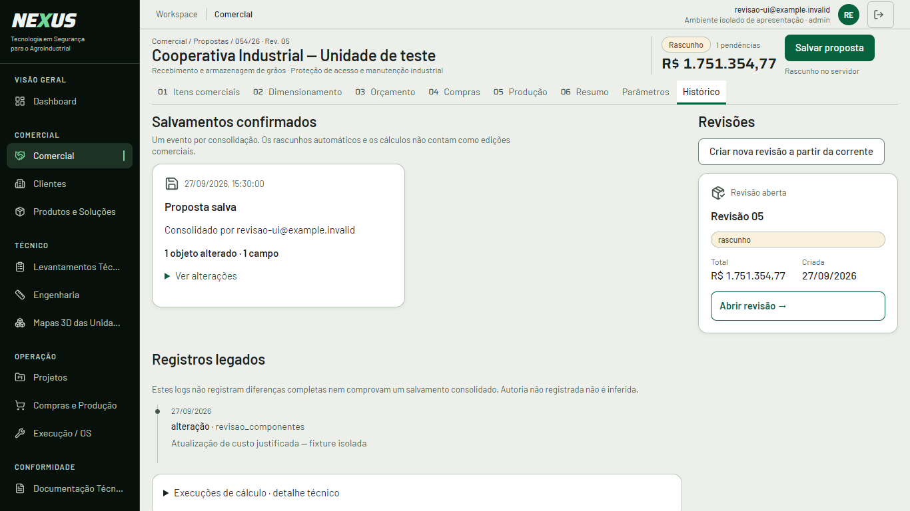

# Capturas antes/depois

Navegador Edge/Chromium real, laboratório isolado. Mesma base de dados de teste: 21 componentes e 17 sistemas. Antes: `5286881c`; depois: branch deste PR. Os dados sintéticos nunca são incluídos no aplicativo nem gravados em produção. Capturas de página inteira, editores, estados e zoom acompanham os arquivos de viewport nas mesmas pastas.

| Etapa | Desktop antes · depois | Mobile antes · depois |
| --- | --- | --- |
| Itens comerciais | [Antes](../ui/evidence/catalog-before/itens-comerciais-1366-viewport.png) · [Depois](../ui/evidence/catalog-after/itens-comerciais-1366-viewport.png) | [Antes](../ui/evidence/catalog-before/itens-comerciais-390-viewport.png) · [Depois](../ui/evidence/catalog-after/itens-comerciais-390-viewport.png) |
| Dimensionamento | [Antes](../ui/evidence/catalog-before/dimensionamento-1366-viewport.png) · [Depois](../ui/evidence/catalog-after/dimensionamento-1366-viewport.png) | [Antes](../ui/evidence/catalog-before/dimensionamento-390-viewport.png) · [Depois](../ui/evidence/catalog-after/dimensionamento-390-viewport.png) |
| Orçamento | [Antes](../ui/evidence/catalog-before/orcamento-1366-viewport.png) · [Depois](../ui/evidence/catalog-after/orcamento-1366-viewport.png) | [Antes](../ui/evidence/catalog-before/orcamento-390-viewport.png) · [Depois](../ui/evidence/catalog-after/orcamento-390-viewport.png) |
| Compras | [Antes](../ui/evidence/catalog-before/compras-1366-viewport.png) · [Depois](../ui/evidence/catalog-after/compras-1366-viewport.png) | [Antes](../ui/evidence/catalog-before/compras-390-viewport.png) · [Depois](../ui/evidence/catalog-after/compras-390-viewport.png) |
| Produção | [Antes](../ui/evidence/catalog-before/producao-1366-viewport.png) · [Depois](../ui/evidence/catalog-after/producao-1366-viewport.png) | [Antes](../ui/evidence/catalog-before/producao-390-viewport.png) · [Depois](../ui/evidence/catalog-after/producao-390-viewport.png) |
| Resumo executivo | [Antes](../ui/evidence/catalog-before/resumo-executivo-1366-viewport.png) · [Depois](../ui/evidence/catalog-after/resumo-executivo-1366-viewport.png) | [Antes](../ui/evidence/catalog-before/resumo-executivo-390-viewport.png) · [Depois](../ui/evidence/catalog-after/resumo-executivo-390-viewport.png) |
| Parâmetros | [Antes](../ui/evidence/catalog-before/parametros-1366-viewport.png) · [Depois](../ui/evidence/catalog-after/parametros-1366-viewport.png) | [Antes](../ui/evidence/catalog-before/parametros-390-viewport.png) · [Depois](../ui/evidence/catalog-after/parametros-390-viewport.png) |
| Histórico | [Antes](../ui/evidence/catalog-before/historico-1366-viewport.png) · [Depois](../ui/evidence/catalog-after/historico-1366-viewport.png) | [Antes](../ui/evidence/catalog-before/historico-390-viewport.png) · [Depois](../ui/evidence/catalog-after/historico-390-viewport.png) |

