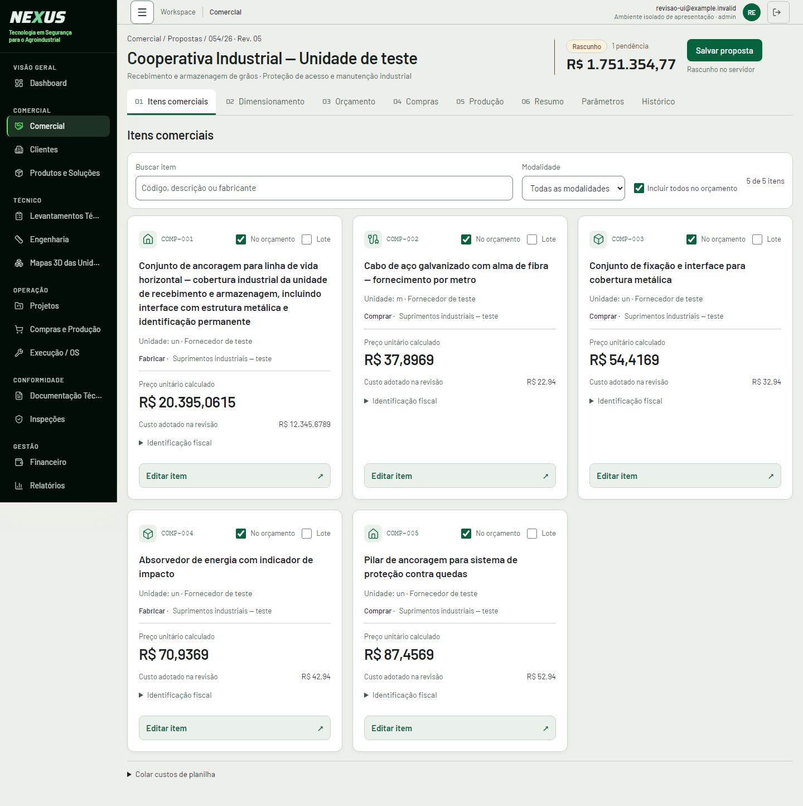
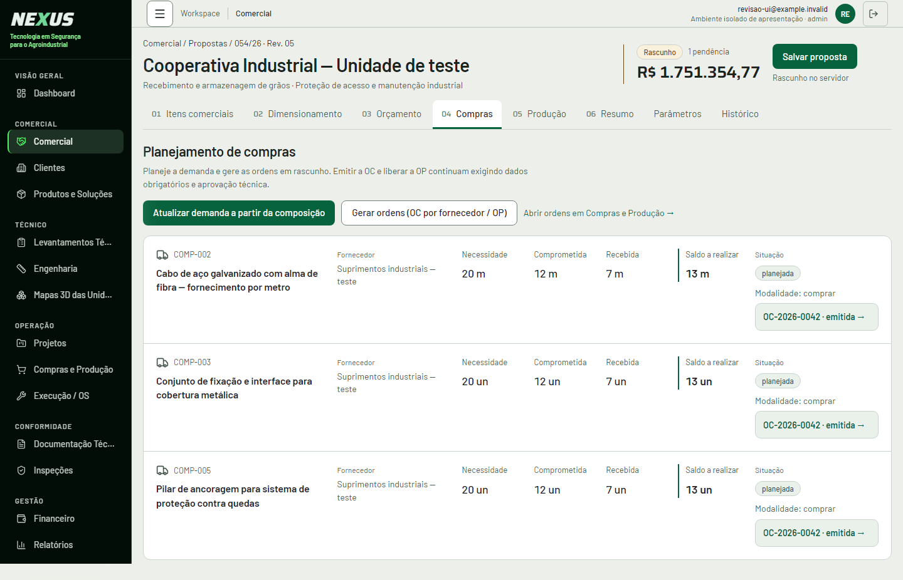
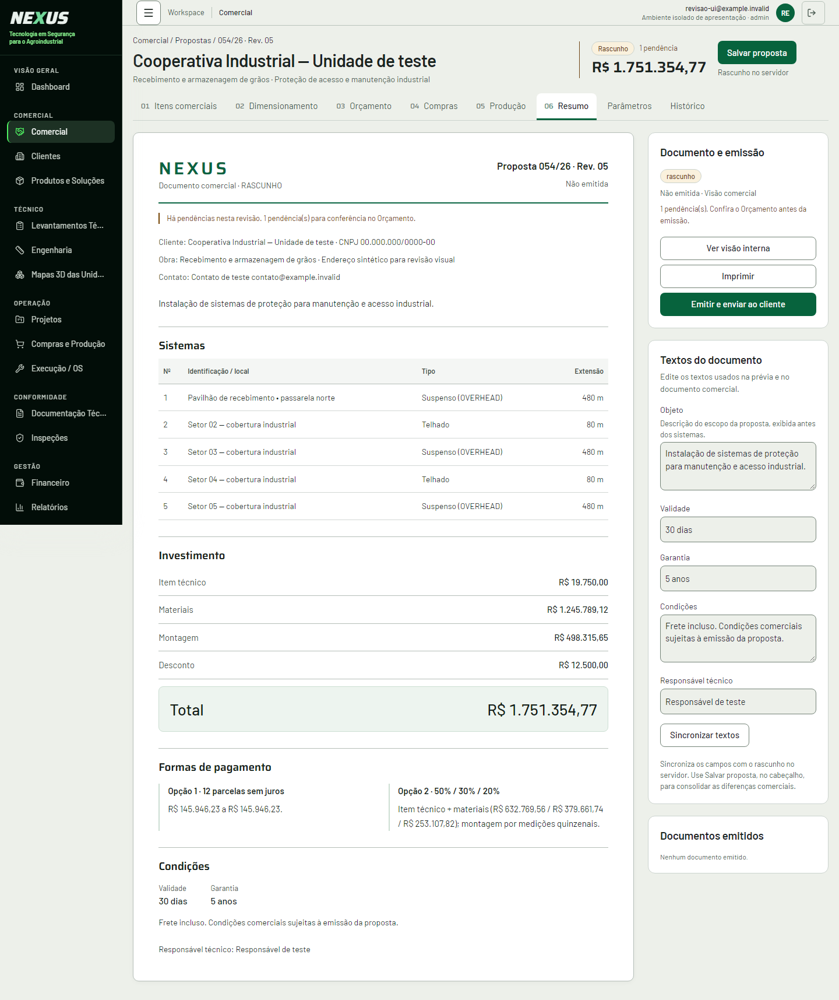

# Refinamento visual da revisão comercial Nexus

Base inspecionada: `6777b0e33eac60f5a9bb85aa900252e8aa98f77b` (`origin/main`, 28/09/2026).
Implementação em branch isolada, sem reescrever histórico publicado.

## Escopo e decisões

| Área                  | Apresentação final                                                                                                                                                                                                                                                                                               |
| --------------------- | ---------------------------------------------------------------------------------------------------------------------------------------------------------------------------------------------------------------------------------------------------------------------------------------------------------------- |
| Cabeçalho e navegação | Identidade, número/revisão, total e salvamento organizados; os oito links mantêm seus destinos. Pendências e cálculo desatualizado próximos do total.                                                                                                                                                            |
| Itens comerciais      | Nome completo, preço unitário em destaque e custo secundário. Inclusão no orçamento e seleção para lote continuam independentes. Busca, modalidade e contagem agrupadas. Grade acompanha a largura disponível, inclusive com inspetor aberto. Precisão monetária existente preservada.                           |
| Dimensionamento       | Número do sistema separado da identificação/local; metragem e trechos maiores que extensão/cabo. Telhado e Suspenso diferenciados discretamente, com explicação junto dos cards. Origem, prévia local e cálculo mantidos. Editar é a ação principal; composição, duplicação, exclusão e confirmação preservadas. |
| Orçamento             | Pendências próximas do investimento e link para o dimensionamento existente. Total sinalizado sem inferir que seja parcial. Grade de sistemas limitada a três colunas. Subtotais, resultado e margem com contraste e hierarquia.                                                                                 |
| Compras               | Lista semântica responsiva: item, fornecedor, quatro quantidades, situação e OC alinhados no desktop, empilhados no celular. Saldo existente em destaque. Fornecedor pendente e ausência de ordem continuam separados, com menos caixas amarelas.                                                                |
| Produção              | Mesmo padrão de quantidades e OP. Estado vazio explica modalidade Fabricar e a ação existente de atualização da demanda; nenhum registro é simulado na aplicação.                                                                                                                                                |
| Resumo                | Documento com a marca textual NEXUS já existente, referência da proposta/revisão, seções de sistemas/investimento/pagamento/condições e total destacado. Estados próximos da emissão; painel dividido entre documento e textos. Objeto e Sincronizar textos explicados. PDFs comercial e interno verificados.    |
| Parâmetros            | Grupos nativos recolhíveis mais compactos e campos legíveis. Ajuda de fração, moeda, produtividade e deslocamento. `0.4` continua `0.4` no input/payload, acompanhado de “40%”. Ajuda nova habilitada somente na revisão; Configurações mantém sua apresentação anterior.                                        |
| Histórico             | Estado vazio menor orienta para Salvar proposta no cabeçalho. Revisão formal, rascunho automático, salvamento consolidado, legado e execução de cálculo permanecem distintos. Revisões exibem somente status/data/total disponíveis.                                                                             |

“Montagem · venda” usa o resultado de `materiais × montagem_percentual` já calculado pelo domínio.
“Total operação · custo” corresponde ao resultado existente de mão de obra, alimentação,
hospedagem, combustível e engenharia. O “Saldo a realizar” continua sendo
`max(0, quantidade_planejada − realizado)`, e não foi renomeado para saldo a comprar.

## Arquivos de aplicação

- `src/features/propostas/ui/revision.css`: estilos limitados a `.nx-revision-flow`; regras de impressão condicionadas à presença do documento da revisão. Sem alteração na identidade da navegação global.
- `src/routes/_authenticated/comercial.propostas.$propostaId.revisoes.$revisaoId.tsx`: organização do cabeçalho e import do CSS local.
- `src/features/propostas/ui/ProductComponentCard.tsx`: identidade, controles e preço do item.
- `src/features/propostas/ui/ObjectCards.tsx`: rótulos dos sistemas e apresentação comum das demandas de compra/produção.
- `src/features/propostas/Dimensionamento.tsx`: explicação dos tipos junto dos sistemas.
- `src/features/propostas/Etapas.tsx`: apresentação de orçamento, planejamento, documento, parâmetros e histórico.

Os componentes de `ItensComerciais.tsx`, `catalog.css` e `editors.css` foram inspecionados e
reutilizados. Não foi necessário alterar seus handlers/estilos compartilhados.

## Preservação e testes

- `npm run typecheck`: passou.
- `npm run test:orcamento`: 28 testes passaram (cálculo, planilha, autorização e fila de salvamento).
- `npm run build`: passou.
- `npm run test:ui`: suíte completa passou, incluindo captura responsiva, acessibilidade, interações do catálogo, etapas e os oito novos grupos de verificação da revisão. Execução local com `NEXUS_UI_CAPTURE_LABEL=revision-after` e `NEXUS_UI_EVIDENCE_DIR=docs/ui/evidence/revision-run-final` para manter as evidências anteriores intactas.
- `npm run lint`: mesma base de 1.676 erros e 8 avisos antes/depois, após eliminar apenas o ruído de finais de linha CRLF da cópia de trabalho. Erros preexistentes principalmente em arquivos de integração Supabase gerados, além de formatação fora deste escopo. Esses arquivos não integram o diff.
- ESLint dos arquivos alterados: zero erros; permanece o aviso anterior de Fast Refresh em `Etapas.tsx`.
- `npm run test:ui:contracts -- 6777b0e`: 56 arquivos protegidos com hashes normalizados iguais. Comparação AST adicional exigiu igualdade de rotas, consultas, hooks de servidor/mutação e handlers principais, inclusive nos arquivos que o comparador antigo tratava como exceções de salvamento.
- Os 51 handlers de eventos JSX nos cinco componentes alterados mantêm exatamente as mesmas expressões da base. `handlers.json` registra essa comparação e a igualdade dos arquivos de cálculo, persistência e funções de servidor.
- Nenhuma alteração em Supabase, migrations, funções de servidor, hooks de persistência, domínio de cálculo, permissões ou consultas. Não houve acesso ao banco de produção.

O laboratório existente precisou acompanhar dois contratos já presentes na base: seleção de lote
separada de inclusão no orçamento e RPC `atualizar_componentes_revisao`. O teste agora verifica o
payload `_rev`, `_ids`, `_patch` e `_esperados` da RPC real. Cenários de identidade repetida,
zeros e pendências foram acrescentados exclusivamente em `tests/ui/`, fora do build da aplicação.

## Evidências de interface

Em 1366 px, os cards passam de quatro colunas de **269,5 px** para três de **361,3 px**.
O primeiro item comercial, com descrição longa agora integral, cai de **552,9 px** para
**509,5 px** de altura. Em Compras, a linha comparável ocupa **188,3 px**, frente ao card
anterior de **398,5 px**. Dimensionamento e Orçamento priorizam tamanho dos números e rótulos;
seus cards ficam mais altos, com leitura mais clara, em vez de reduzir fontes para caber.

- Matriz geral: 88 combinações (11 telas, incluindo oito abas e páginas relacionadas, em 320, 360, 390, 768, 1024, 1366, 1440 e 1920 px), sem overflow de página ou erro de JavaScript.
- Matriz específica: oito abas em 390, 1024, 1440 e 1920 px; 100 registros com inspetor aberto em 390/1366/1920; descrições longas; identificação repetida; zero legítimo; ausências; somente leitura; custos restritos; estado vazio; todos os 22 parâmetros e salvamento de fração.
- Interações: foco/teclado/Escape, seleção filtrada para lote, justificativa de custo, conflitos, edição durante resposta do servidor, retry e chave de idempotência, colagem confirmada, revisões formais e navegação de ordens.
- Contraste dos pares de texto e controles, tema escuro, redução de movimento e enquadramento do total no celular conferidos pelos testes existentes.
- Impressão: PDF A4 comercial e interno com cinco sistemas de teste, duas páginas cada, renderizadas com Poppler e inspecionadas. Fundo branco, sem ferramentas/cabeçalho da aplicação; dados internos presentes apenas na visão interna. Extração textual também confirmou ausência de controles e presença das condições/pagamentos.

As capturas e relatórios ficam em [evidence/revision-refinement](evidence/revision-refinement/).
`layout-comparison.json` registra larguras/colunas antes/depois; `checks.json` registra os casos
específicos; `preservation.json` registra contratos e hashes; `print-checks.json` registra a
conferência dos PDFs. Os scripts também exercitam 17/100/500 registros; seus tempos são somente
medidas locais de interação, não latência de rede nem confirmação de gravação.

## Dados e limites de evidência

As imagens fornecidas mostram identificações “22” repetidas e extensões/valores zerados.
Esses valores não foram renomeados nem substituídos pela interface. Sem consultar os registros
de produção, não é possível concluir se são erros cadastrais ou resultados válidos. O cenário
isolado comprova que identidades repetidas e zero continuam visíveis; ausência de identificação
ou de um resultado por sistema recebe rótulo explícito, sem inferência a partir do valor zero.

As respostas de sessão e banco são isoladas no laboratório: estes testes não homologam RLS,
autenticação, emissão real, dados reais, impressão física, Safari/iOS ou Android físico.
Não houve deploy ou merge. A PR deve informar separadamente o estado atual do CI remoto.
